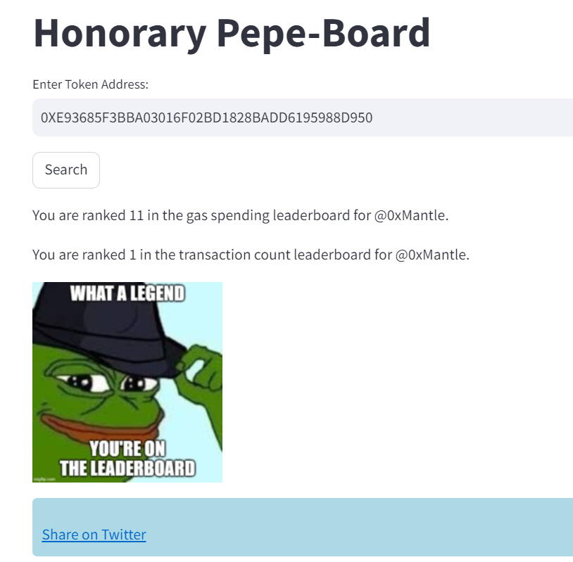

<h1><div align=center>📊 analyzooor</div></h1>

## Description
#### Tagline : Analysis + Meme Generator


#### The Problem to Solves
Still scratching head for good memes? Search no longer meme lovers! We believe your on-chain activity is a meme. That inspired us to build **Analyzoor** to create memes based on your onchain activity, making analysis more funs and interactive!
<br>


#### Challenges
1. Lacking APIs for aggregated stats on Mantle, free APIs like DeBank have rate limits.
2. SQL Platform like Dune and Flipside doesn't support Mantle yet, while Covalent has only limited datasets available for Mantle.

#### Technologies Used
- Python, SQL
- Streamlit - for FE
- Mantle Explorer APIs, DeBank APIs - for data extractions
- Covalent Increment - for querying leaderboard data using SQL
- imgflip - for meme generators

## Pictures
#### Selections Menu

<br>

#### Lonely Pepe Mode: Wallet Stats

<br>

#### Lonely Pepe Mode: Twitter Sharing Feature

<br>

#### Pepe VS Friend Mode: It's a Battle!

<br>

#### Honorary Pepe-Board: What a Lenged!

<br>

#### Honorary Pepe-Board: Top Leaderboard


## Setup
### [Prerequisite] Prepare .env file
```bash
# PROXY is needed for DeBank API 
# (for POC purpose we will precall the APIs under data/{wallet address})
PROXY=
# ADDRESS LIST that we've already precalled for POC
ADDRESS_1='0xCa6868F11a099295Fe7F3BDD705d2d7a1c2214B7'
ADDRESS_2='0x665E32B4B787637D34b8526F7618e4A441635996'
ADDRESS_3='0xb3821AB318a13D0fBd3B3F5090dc1Bf01BA928b6'
ADDRESS_4='0x746eD74c3F0110a130E7bf464ADfDf51da3a8FE4'
ADDRESS_5='0xE4EDB277E41DC89AB076A1F049F4A3EFA700BCE8'
```

### [Prerequisite] Virtual Environment setup and sync with requirements.txt
```bash
python3 -m venv venv
source venv/bin/activate
pip3 install -r requirements.txt --upgrade
```
### Data Preparation (POC)
```bash
# Extract all the necessary data using APIs
python data_extractor.py

# Massaging data extracted
python data_massagor.py

# Run query from sql/ under Covalent Increment Platform
# Save CSVs from Covalent results and put it under data/leaderboard/
```

### To run streamlit
```bash
source venv/bin/activate
streamlit run streamlit.py
```